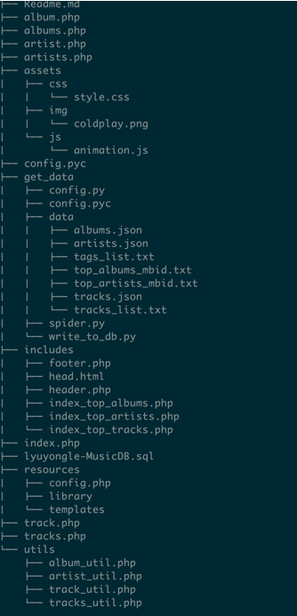

## About This Application
This is the first project for course [CSCE608](http://faculty.cs.tamu.edu/chen/) Database System.  

This application devotes most into music related data. It provides you a friendly UI to get information about famous artists, their top albums and all the related songs. Also you can add comments to your favorite songs.  

There are four main pages which are index, artists, albums and tracks. Their descriptions are as follows.

#### 1 Homepage
There are three sections in this page.   

The first section is 12 top artists with their names and pictures. It's ranked by their listeners. Examples like Coldplay, Radiohead, Red Hot Chili Peppers and Rihanna. The link will direct you to their profile page, which give you more information about that artist, like their albums and famous tracks.  

The second section have 6 top albums, with album name and artist list below. Same as the top artists section, it is also ranked by their listeners. The link will redirect you to the page which give you details about the album.  

The third section are top tracks. Top hits of Rock, Alternative, Pop, Indie are listed. Also, related links are provided.

#### 2 Artists Page
This page provide you all the records about artists, about 50 artists. In the left sidebar, it is a list of artists which are ordered by their names. In the right section, artists are ordered by their popularity, i.e listeners. Links are kindly provided.

#### 3 Albums Page
This section share the same design with artists page section. A whole list of albums is provides. Ranked by name and listeners separately.

#### 4 Tracks Page
This section is a little different from the artists and albums section. In the left sidebar, a list of tags are provided which are ordered by name. Each tag can reach certain number of tracks. Also a track can have more than one tags attached to it. It is a many to many relation and a junction table exists in database. Right side of the page has three top 30 hits for Rock, Pop and Indie. Also may notice the badge with each track which is their play count.

#### 5 Others 
Apart from those list like page, there are several other pages like artist, album and track page. Artist page has their top tracks and all albums listed. Album page has its tracks listed and track page has it's details and comments listed.

## Data

#### Data Collection
The data is kindly provided by last.fm [API](http://www.last.fm/api/intro). Last fm provided very powerful API. Just make requests with your API key and query string, and JSON will be returned. Some of them are used in this project.  

- [Top Artists API](http://www.last.fm/api/show/chart.getTopArtists), return the top 50 artists
- [Artist Info API](http://www.last.fm/api/show/artist.getInfo), return details information about a artist
- [Top Albums API](http://www.last.fm/api/show/artist.getTopAlbums), return top albums of an artist
- [Album Info API](http://www.last.fm/api/show/album.getInfo), return album details
- [Track Info API](http://www.last.fm/api/show/track.getInfo), return track details

The data collection flow is as follows. Get top artists -> Get their top albums -> Get all tracks for albums and then extract detail information from JSON files. I use Python to send requests and retrive information. Source code can by found on my github [repository](https://github.com/lyltj2010/MusicDB/blob/master/get_data/spider.py).

#### Data Storage
Data are stored in MySQL database. I use python to create database tables and insert into records. Source code can by found [on my github](https://github.com/lyltj2010/MusicDB/blob/master/get_data/write_to_db.py). Tables are created by the create table function group. Data are inserted by the insert into function group. Every time you want to change the data schema, just run this script and database will be reset and data reinserted.

#### Database Schema
There are six tables in total, artist, album, track, tag, track_tag and comment. Basic relation is describe here. Each has many albums, each album has many tracks, each track has many comments. These are one to many relationship. Album has a foreign key of artist and track has foreign key of album etc. Artist, album and track have mbid which is a unique identifier.   

Each track has many tags and each tag can reach many tracks. It is a many to many relationship. So a junction table is created, which provide the functionality to retrieve all tracks of a specified tag or tag of a specified track.  

Details of certain tables description are list below.  

**Artist:**

| Field       | Type     | Null | Key | Default |
|-------------|----------|------|-----|---------|
| name        | char(50) | NO   |     | NULL    |
| mbid_artist | char(50) | NO   | PRI | NULL    |
| url         | char(80) | YES  |     | NULL    |
| listeners   | int(11)  | YES  |     | NULL    |
| playcount   | int(11)  | YES  |     | NULL    |
| image       | text     | YES  |     | NULL    |

**Album:** 
 
| Field       | Type      | Null | Key | Default           |
|-------------|-----------|------|-----|-------------------|
| name        | char(50)  | NO   |     | NULL              |
| artist      | char(50)  | YES  |     | NULL              |
| mbid_album  | char(50)  | NO   | PRI | NULL              |
| mbid_artist | char(50)  | YES  | MUL | NULL              |
| listeners   | int(11)   | YES  |     | NULL              |
| playcount   | int(11)   | YES  |     | NULL              |
| image       | text      | YES  |     | NULL              |
| published   | timestamp | NO   |     | CURRENT_TIMESTAMP |

**Track:**  

| Field       | Type         | Null | Key | Default | 
|-------------|--------------|------|-----|---------|
| name        | char(50)     | NO   |     | NULL    |
| mbid_track  | char(50)     | NO   | PRI | NULL    |
| url         | char(80)     | YES  |     | NULL    |
| artist      | char(50)     | YES  |     | NULL    |
| mbid_artist | char(50)     | YES  |     | NULL    |
| album       | char(50)     | YES  |     | NULL    |
| mbid_album  | char(50)     | YES  | MUL | NULL    |
| duration    | mediumint(9) | YES  |     | NULL    |
| listeners   | int(11)      | YES  |     | NULL    |
| playcount   | int(11)      | YES  |     | NULL    |

## Program Structure
Below is a tree display of file structure. Files with php extension under root folder are the main pages of this application. Folder assets keep code about style sheets and javascript code. Folder get_data contain all the code and data to get a full functional database. Folder includes partials of main page which significantly simplify the code. Folder utils holds php function and code that connect database or execute sql statements,  which also help keeps the main page clean.   

